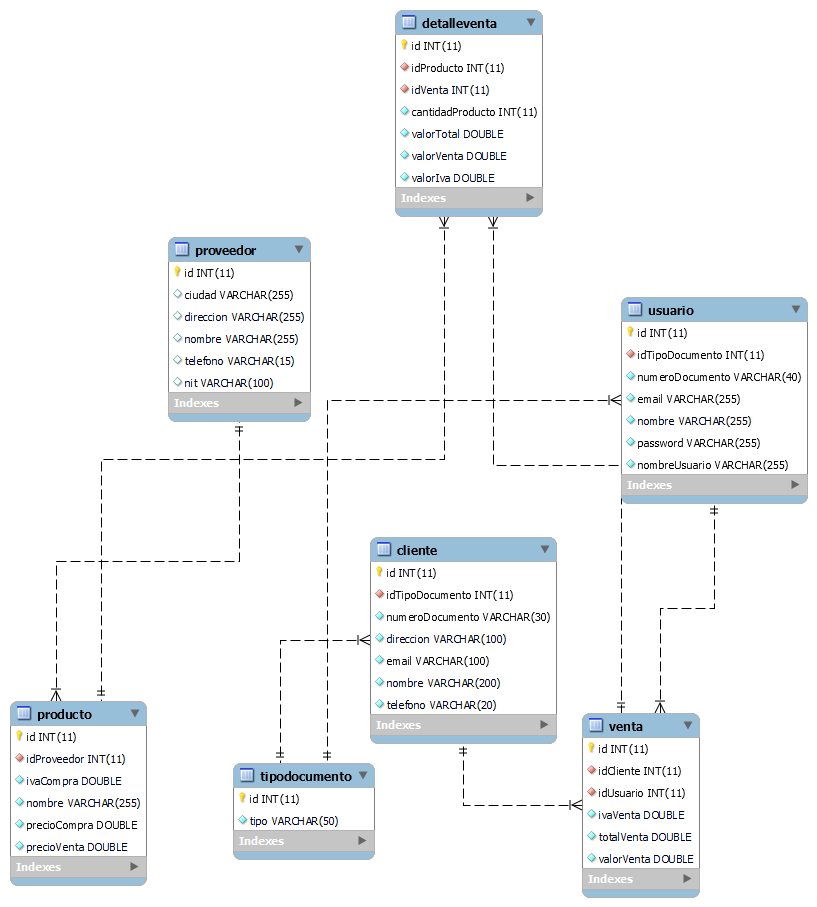

# Proyecto: Tienda
Este proyecto (taller) se centra en construir un API REST de varias tablas con integridad referencial. El diagrama Entidad/Relación es el siguiente.

> *Fuentes: prof. Carlos Beltrán*

Adicionalmente, el proyecto cuenta con documentación hecha en Swagger, la cual puede ser accedida, una vez ejecutado el proyecto, desde:
http://localhost:8094/swagger-ui/index.html